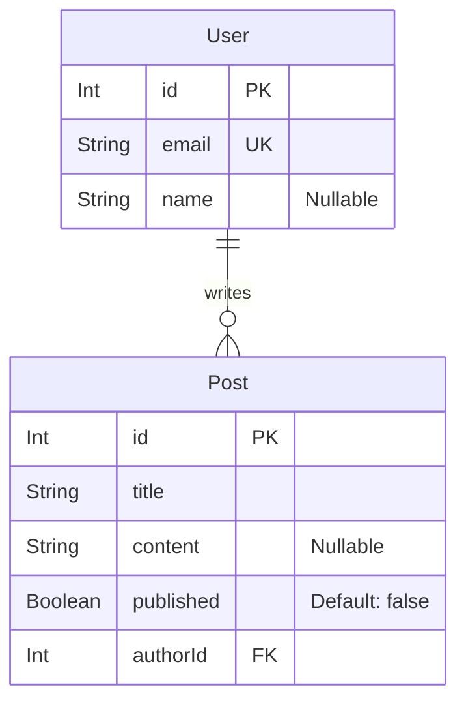

# Data Model: Initial Setup (001-init)

## 1. Schema Diagram


## 2. Prisma Schema Source
```prisma
model User {
  id    Int     @id @default(autoincrement())
  email String  @unique
  name  String?
  posts Post[]
}

model Post {
  id        Int     @id @default(autoincrement())
  title     String
  content   String?
  published Boolean @default(false)
  author    User    @relation(fields: [authorId], references: [id])
  authorId  Int
}
```
